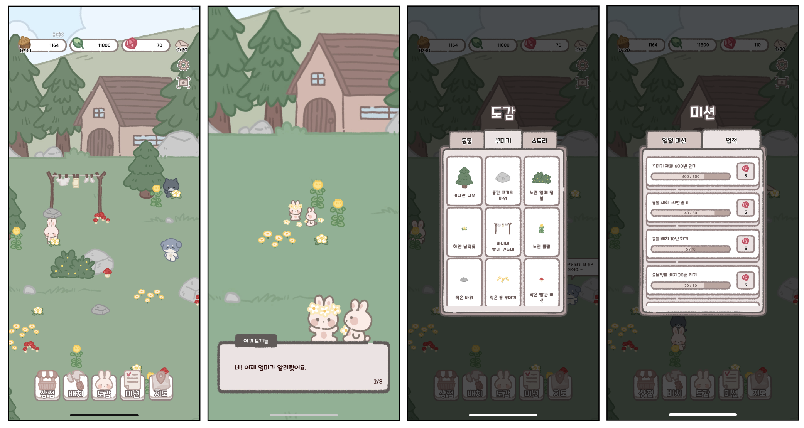
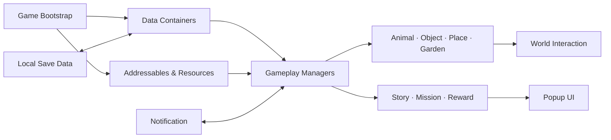

  
  <h1>Leafy Paw Parcels</h1>
  
<strong>숲속 우체부와 동물 친구들이 함께 살아가는 모바일 힐링 수집 게임</strong>

  

    동물을 수집하고, 숲속 공간을 꾸미고, 선물과 작물을 통해 
    친밀도와 이야기를 열어가는 2D 모바일 캐주얼 게임입니다.
  

  

    
    
    
    
    
  

## Gameplay

  

  숲속 마을 꾸미기 · 동물 스토리 · 도감과 컬렉션 · 미션과 보상

## Project Overview

> Leafy Paw Parcels는 동물 수집, 공간 꾸미기, 친밀도, 작물, 스토리, 미션 보상을 하나의 성장 루프로 묶은 모바일 힐링 수집 게임입니다.

| 구분 | 내용 |
| --- | --- |
| 장르 | 모바일 캐주얼 · 수집 · 꾸미기 · 방치형 보상 |
| 핵심 루프 | 재화 수집 → 동물/오브젝트 해금 → 배치/친밀도 성장 → 스토리 오픈 |
| 구현 콘텐츠 | 4개 장소 · 동물/스킨 프리팹 80여 개 · 오브젝트 프리팹 140여 개 · 스토리/미션/상점 데이터 |
| 개발 환경 | Unity 6000.3.7f1 · C# · URP 2D |
| 주요 플랫폼 | Android · iOS |
| 개발 상태 | In Development |

## My Contribution

Unity 클라이언트의 주요 게임 시스템과 모바일 서비스 연동 흐름을 구현하고 개선했습니다.

- 동물, 오브젝트, 장소, 정원, 스토리, 미션 매니저 구조 구성
- 데이터 테이블과 ScriptableObject를 활용한 콘텐츠/밸런스 관리 구조 구현
- 동물 수집, 스킨, 꾸미기 배치, 숨겨진 오브젝트, 작물 성장/수확 시스템 구현
- 도감, 꾸미기, 상점, 미션, 지도, 부스트 등 팝업 기반 UI 플로우 구성
- Addressables 기반 리소스 그룹 관리와 로딩 흐름 구성
- 모바일 터치 입력과 Unity Editor Game View 마우스 입력 대응
- Google Mobile Ads 보상형 광고와 Unity Purchasing 인앱 결제 연동
- 데모/퍼블리셔 전달 빌드를 위한 QA 항목과 콘텐츠 오픈 전략 정리

## Core Gameplay

### 동물 수집과 친밀도

- 장소별 조건을 만족해 동물과 동물 스킨을 해금
- 동물에게 선물을 주고 친밀도를 올리는 감성 상호작용
- 터치, 대화, 보상 루프를 통해 동물을 단순 재화 생산 대상이 아닌 수집/애착 대상으로 설계

### 숲속 공간 꾸미기

- 장소별 오브젝트를 배치하고 편집하는 꾸미기 시스템
- 오브젝트 회수, 이동, 재배치, 숨겨진 오브젝트 발견 흐름
- 도감과 배치 UI를 연결해 수집 목표와 공간 커스터마이징을 함께 제공

### 작물과 보상 루프

- 정원 플롯에 작물을 배치하고 성장 상태에 따라 수확
- 일일 미션, 업적, 광고 보상, 부스트를 통해 짧은 세션에서도 보상감을 제공
- 동물 재화, 오브젝트 재화, 보석을 분리해 성장 목적을 명확히 구성

### 스토리와 장소 확장

- 장소별 스토리 프리팹과 컷신/대화 UI 구성
- 스토리 오픈 조건을 데이터로 분리해 진행 상황에 따라 콘텐츠를 해금
- 지도와 장소 전환을 통해 플레이어가 새로운 공간을 발견하는 흐름 제공

## Technical Highlights

| 영역 | 구현 내용 | 대표 코드 |
| --- | --- | --- |
| Data-driven Content | 동물, 오브젝트, 스토리, 상점, 미션, 작물 데이터를 컨테이너 구조로 로드 | [`Container`](./Assets/Scripts/Data/Container/Container.cs) · [`AnimalContainer`](./Assets/Scripts/Data/Container/AnimalContainer.cs) |
| Asset Management | Addressables와 리소스 매니저를 이용해 UI, 동물, 오브젝트, 장소 리소스를 관리 | [`ResourceManager`](./Assets/Scripts/GameSystem/Resource/ResourceManager.cs) · [`AddressableAssetLoader`](./Assets/Scripts/GameSystem/Resource/AddressableAssetLoader.cs) |
| Gameplay Managers | 동물, 오브젝트, 장소, 정원, 스토리를 매니저 단위로 분리 | [`AnimalManager`](./Assets/Scripts/Game/AnimalManager.cs) · [`ObjectManager`](./Assets/Scripts/Game/ObjectManager.cs) · [`PlaceManager`](./Assets/Scripts/Game/Place/PlaceManager.cs) |
| Decoration Flow | 도감/배치 UI와 월드 오브젝트 편집 상태를 연결 | [`Arrangement`](./Assets/Scripts/UI/Popup/Arrangement.cs) · [`ObjectArrangementCell`](./Assets/Scripts/UI/Component/ObjectArrangementCell.cs) |
| Garden System | 정원 플롯 생성/제거, 작물 배치, 성장/수확 흐름 관리 | [`GardenManager`](./Assets/Scripts/Game/GardenManager.cs) · [`GardenPlot`](./Assets/Scripts/Game/Object/GardenPlot.cs) |
| Mission & Notification | 일일 미션, 업적, 알림 갱신을 통해 반복 플레이 동기를 제공 | [`Acquire`](./Assets/Scripts/Game/Manager/Acquire.cs) · [`Notification`](./Assets/Scripts/Game/Notification.cs) |
| Input Handling | 모바일 터치와 에디터 Game View 마우스 입력을 동일한 월드 입력 흐름으로 처리 | [`InputManager`](./Assets/Scripts/GameSystem/Input/InputManager.cs) · [`InputHandler`](./Assets/Scripts/GameSystem/Input/InputHandler.cs) |
| Ads & IAP | 보상형 광고 로드/표시/콜백 처리와 인앱 결제 상품 구매 흐름 구현 | [`AdProvider`](./Assets/Scripts/GameSystem/AdProvider.cs) · [`IAP`](./Assets/Scripts/Game/Manager/IAP.cs) |

## System Architecture

## Tech Stack

- **Engine / Language**: Unity 6000.3.7f1, C#
- **Rendering**: Universal Render Pipeline 17.3.0, 2D Renderer
- **Assets / Data**: Addressables 2.8.0, ScriptableObject, text data tables
- **Async / UX**: UniTask, DOTween, Cinemachine, Timeline
- **UI / Localization**: UGUI, TextMesh Pro, Unity Localization
- **Mobile Services**: Unity Purchasing, Google Mobile Ads, Google Play Games
- **Backend Hooks**: Unity Analytics, Unity Authentication, Unity Cloud Save, Firebase integration placeholder

## Run Locally

1. Unity Hub에 **Unity 6000.3.7f1**을 설치합니다.
2. 저장소를 클론한 뒤 프로젝트 루트를 Unity Hub에서 엽니다.
3. Build Settings의 Scene List에 아래 씬이 포함되어 있는지 확인합니다.
   1. `Assets/Scenes/BeginScene.unity`
   2. `Assets/Scenes/GameScene.unity`
4. `BeginScene`을 시작 씬으로 두고 Play를 실행합니다.
5. Android/iOS 빌드 전 Addressables 콘텐츠와 플랫폼별 설정을 확인합니다.

## Build & QA Notes

- Android SDK/NDK/JDK는 Unity Hub의 Android Build Support 구성을 사용합니다.
- 내부 테스트 중에는 실제 AdMob 광고 단위 ID 반복 호출 대신 Google 테스트 광고 ID 또는 테스트 디바이스 등록을 권장합니다.
- 외부 전달용 데모 빌드는 모든 동물, 스킨, 장소, 스토리, 주요 꾸미기 오브젝트가 열린 상태로 구성하는 것이 좋습니다.
- `UserSettings/` 아래 Unity 에디터 레이아웃 파일은 개인 환경 설정이므로 일반적으로 커밋하지 않습니다.

## Future Improvements

- 오늘의 소포: 매일 맵에 등장하는 랜덤 편지/소포 이벤트
- 길 잃은 동물 방문: 보유하지 않은 동물이 잠시 방문하는 짧은 이벤트
- 테마 컬렉션 앨범: 동물, 스킨, 꾸미기, 작물을 세트로 묶는 장기 목표
- 2주 시즌 이벤트: 기존 리소스를 활용한 이벤트 재화와 보상 트랙
- Firebase Analytics / Crashlytics: 유저 행동, 광고, 구매, 크래시 분석 강화

## English Summary

**Leafy Paw Parcels** is a mobile cozy collection game built with Unity. Players collect animal friends, decorate forest locations, grow crops, give gifts, unlock short stories, and progress through mission and reward loops. The project includes data-driven content containers, Addressables-based asset loading, modular gameplay managers, popup-based UI, mobile input handling, rewarded ads, and IAP integration.
